# Melbourne Housing Market Analysis & Price Prediction

This project analyses Melbourne housing sales data using **Power BI** and **Python machine learning**. The dashboard explores market trends, regional and suburb-level price differences, property feature price drivers, and machine learning-based price recommendations.

The final report contains four Power BI pages:

1. **Melbourne Housing Market Overview**
2. **Regional & Suburb Price Insights**
3. **Property Features & Price Drivers**
4. **Price Prediction & Market Recommendations**

---

## Dashboard Image Folder Structure

All dashboard screenshots used in this README are stored in the following folder structure:

```text
Melbourne_Housing_images/
├── Overview/
├── Regional/
├── Property/
└── predictions/
```

---

## 1. Data Cleaning and Transformation

The original Melbourne housing dataset contained **27,114 property sale records** and 16 columns, including suburb, property type, seller, sale date, distance from the CBD, property features, and price.

Before building the Power BI dashboard, the dataset was cleaned and transformed to improve data quality, support accurate aggregation, and prepare the data for machine learning.

### 1.1 Data Quality Issues

Several property feature columns contained missing or invalid values. The most significant data quality issues were found in `BuildingArea`, `YearBuilt`, `Landsize`, `Bedroom`, `Bathroom`, and `Car`.

| Column | Missing / Invalid Records | Percentage of Dataset |
|---|---:|---:|
| BuildingArea | 16,585 | 61.2% |
| YearBuilt | 15,129 | 55.8% |
| Landsize | 9,241 | 34.1% |
| Car | 6,817 | 25.1% |
| Bathroom | 6,442 | 23.8% |
| Bedroom | 6,436 | 23.7% |

The `BuildingArea` column also contained invalid values such as `missing` and `inf`, which were converted into null values. In addition, **11 duplicate records** were removed, reducing the dataset from **27,114 rows to 27,103 rows**.

### 1.2 Why Missing Rows Were Not Fully Removed

Although several fields had high missing-value rates, the rows were not removed entirely. Removing every row with missing values in `BuildingArea`, `YearBuilt`, `Landsize`, `Bedroom`, `Bathroom`, and `Car` would remove approximately **67.5% of the dataset**.

This would leave only around one-third of the original data and significantly reduce the reliability of regional, suburb-level, and time-based analysis. Instead, missing values were retained where appropriate, while specific visuals and machine learning steps handled missing values through filtering, imputation, or model-scope rules.

### 1.3 Transformation Steps

The main transformation steps included:

- Converted `Date` into a valid date format.
- Removed duplicate records.
- Converted numeric fields such as `Price`, `Distance`, `Landsize`, `BuildingArea`, `Bedroom`, `Bathroom`, and `Car` into numeric data types.
- Replaced invalid `BuildingArea` values such as `missing` and `inf` with null values.
- Standardised property type labels:
  - `h` → `House`
  - `u` → `Unit`
  - `t` → `Townhouse`
- Created a unique `Sales_ID` for each property transaction.
- Created date, suburb, seller, and property type dimension tables.
- Built a star schema model in Power BI.
- Created distance bands and land size bands for clearer grouped analysis.

### 1.4 Use of Median and Average

The dashboard uses both **median** and **average** depending on the purpose of each visual.

**Median price** was used as the main price comparison metric because property prices are highly skewed and affected by extreme outliers. For example, the highest sale price in the dataset is approximately **$11M**, while the median sale price is approximately **$871K**. Median price gives a more stable view of typical market value.

**Average values** were used for general numeric summaries such as average rooms, average actual price, average predicted price, and average value gap. In the machine learning page, averages help summarise model output across all predicted records.

---

# 2. Page 1: Melbourne Housing Market Overview

The overview page provides a high-level summary of Melbourne housing market performance between **2016 and 2018**.

## What business question does this page answer?
- How many property sales were recorded?
- What were the average, median, highest, and lowest sale prices?
- Which regions had the highest median property prices?
- Which property types dominated the market?
- How did sales volume and median price change over time?

## 2.1 Median Price KPI

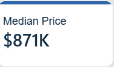

The median property price is approximately **$871K**. Median price was used because it is less sensitive to extreme high-value sales and provides a more reliable indicator of the typical property price in the market.

## 2.2 Total Sales KPI

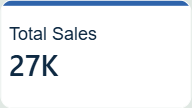

The cleaned dataset contains approximately **27K property sales**. This provides a strong transaction base for analysing regional trends, suburb rankings, property type differences, and feature-based price drivers.

## 2.3 Average Price KPI

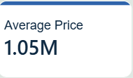

The average property price is approximately **$1.05M**, which is higher than the median price. This difference suggests that high-value property sales pull the average upward, confirming that the dataset contains price outliers.

## 2.4 Highest Price KPI

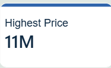

The highest recorded sale price is approximately **$11M**. This large value supports the decision to use median price as the primary price metric in most comparison visuals.

## 2.5 Lowest Price KPI

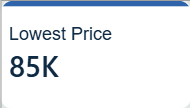

The lowest recorded property price is approximately **$85K**. The wide gap between the lowest and highest prices shows that the dataset covers a broad range of property values across different locations and property types.

## 2.6 Median Property Price by Region

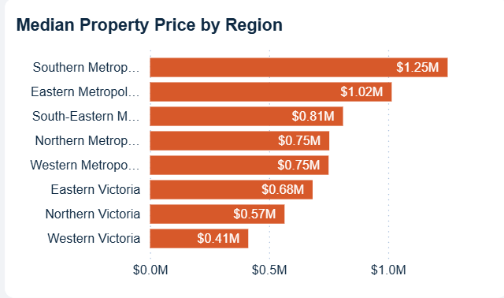

Southern Metropolitan has the highest median property price at approximately **$1.25M**, followed by Eastern Metropolitan at around **$1.02M**. Western Victoria has the lowest median price at approximately **$413K**. This highlights a clear price divide between premium metropolitan areas and outer regional areas.

## 2.7 Quarterly Property Sales Volume

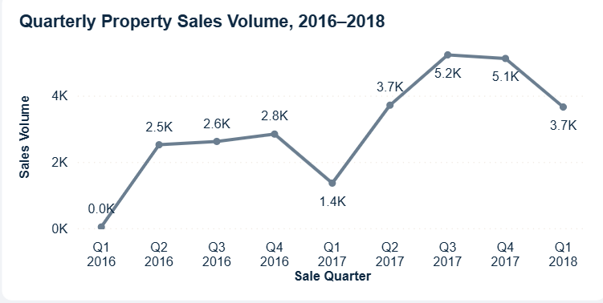

In 2016, sales volumn increase dramatically from quarter 1 to quarter 2 with 2,600 property being sold. From Q2 2016 to Q4 2016, property sales volume increased gradually from approximately **2.5K** to **2.8K** transactions. This indicates steady market activity during the second half of 2016. However, sales volume then dropped sharply to around **1.4K** in Q1 2017, suggesting a temporary slowdown in transaction activity at the beginning of 2017. However, sales volume increased strongly after Q1, reaching its highest levels in **Q3 2017** and **Q4 2017**, with more than **5K transactions** in each quarter. This suggests stronger market activity during 2017 compared with earlier periods.

## 2.8 Sales Distribution by Property Type

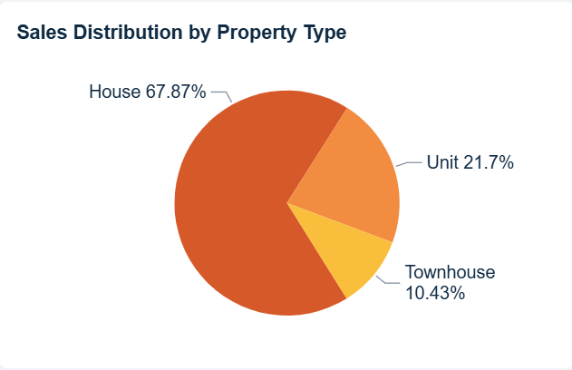

Houses dominate the dataset, accounting for approximately **67.9%** of total sales. Units represent about **21.7%**, while townhouses account for around **10.4%**. This indicates that houses are the main property type in the dataset and strongly influence overall market patterns.

## 2.9 Quarterly Median Property Price

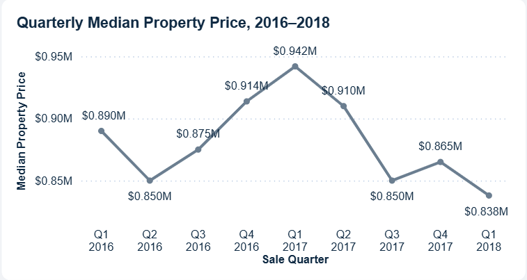

Median property price peaked around **Q1 2017** at approximately **$942K**, before declining in later quarters. This shows that price and transaction volume did not always move in the same direction, which is why both sales volume and median price were analysed together.

---

# 3. Page 2: Regional & Suburb Price Insights

This page focuses on regional price differences, suburb rankings, and distance-based market patterns.

## What business question does this page answer?
- Which regions are the most expensive?
- Which regions have the highest sales volume?
- Which suburbs have the strongest transaction activity?
- Which suburbs have the highest or lowest median prices?
- How does distance from the CBD affect median property price?

## 3.1 Top 10 Suburbs by Sales Volume

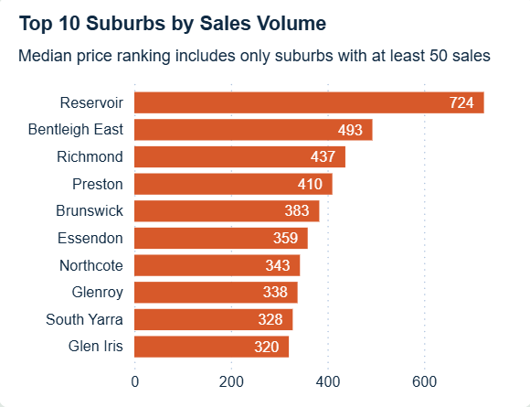

Reservoir has the highest sales volume with **724 sales**, followed by Bentleigh East with **493 sales**, Richmond with **437 sales**, and Preston with **410 sales**. These suburbs represent strong transaction activity and may indicate areas with higher buyer demand or more active housing supply.

## 3.2 Median Property Price by Region

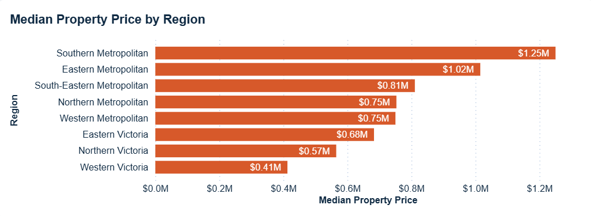

Southern Metropolitan remains the most expensive region, with a median price of approximately **$1.25M**. Eastern Metropolitan follows at around **$1.02M**. The regional price gap shows that location is one of the strongest drivers of property value in Melbourne.

## 3.3 Sales Volume by Region

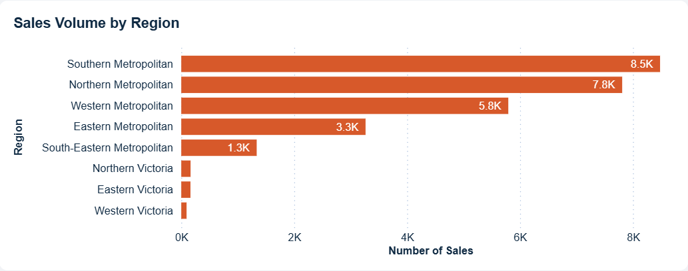

Sales activity is concentrated mainly in Southern Metropolitan, Northern Metropolitan, and Western Metropolitan regions. These regions account for the largest number of transactions, suggesting stronger market liquidity compared with regional Victoria areas.

## 3.4 Median Property Price by Distance from CBD

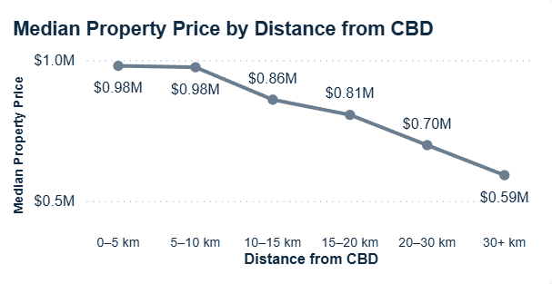

The distance analysis shows that properties closer to the CBD have higher median prices. Properties within **0–5 km** and **5–10 km** from the CBD have median prices close to **$980K**, while properties more than **30 km** away have a median price of approximately **$592K**. This confirms that proximity to the CBD remains a major location-based price driver.

---

# 4. Page 3: Property Features & Price Drivers

For the Property Features & Price Drivers page, **April 2016** was selected as a sample period because the visuals show clear and interpretable feature-price patterns.

## What business question does this page answer?
- How does property type affect median price?
- Do more bedrooms, bathrooms, or car spaces lead to higher prices?
- How does land size relate to median property price?
- Which property features appear to be the strongest price drivers?
- How do these relationships change across selected time periods?

## 4.1 April 2016 KPI Summary

For the sample analysis, April 2016 was selected to demonstrate how property features affected prices within a specific month.

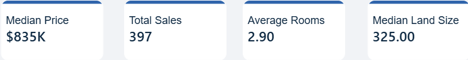

In April 2016, the dataset recorded **397 property sales**, with a **median property price of approximately $835K**. The average number of rooms was **2.90**, and the median land size was **325 sqm**. This provides a focused monthly sample for analysing how property characteristics relate to price.

## 4.2 Median Property Price by Property Type

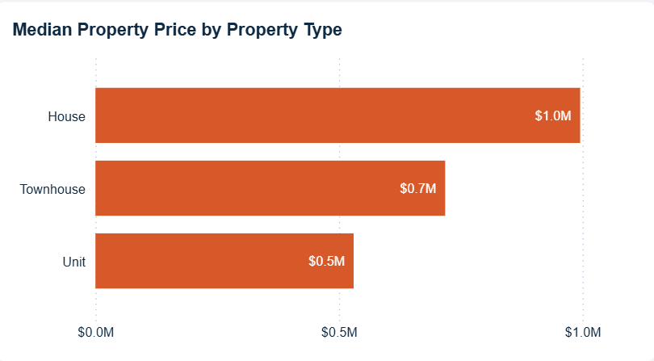

Houses recorded the highest median price at approximately **$1.0M**, followed by townhouses at around **$0.7M** and units at around **$0.5M**. This shows that property type is a strong price driver. Houses generally command higher prices because they often provide more living space, larger land size, and greater flexibility for future renovation or redevelopment.

## 4.3 Median Property Price by Bathroom Count

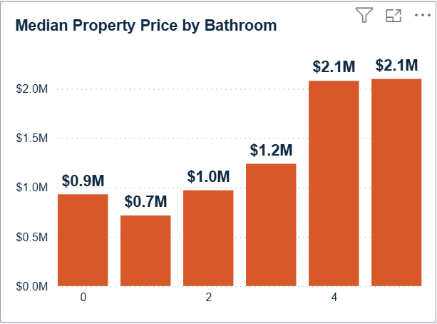

The bathroom analysis shows a generally positive relationship between bathroom count and median price. Properties with **2 bathrooms** had a median price of around **$1.0M**, while properties with **3 bathrooms** increased to approximately **$1.2M**. Properties with **4 or 5 bathrooms** reached around **$2.1M**. This suggests that additional bathrooms are associated with higher property value. However, the 0-bathroom group should be interpreted carefully because it may include incomplete or unusual records.

## 4.4 Median Property Price by Bedroom Count

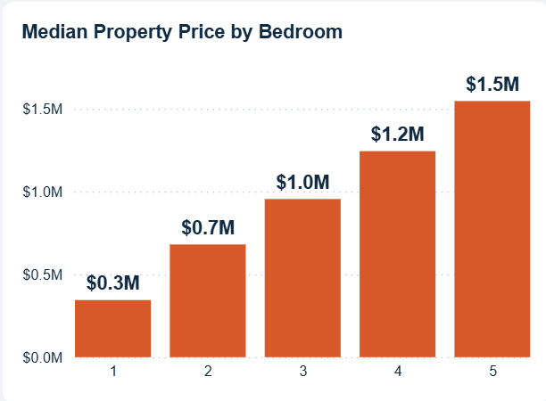

Bedroom count shows a clearer upward relationship with price. Properties with **1 bedroom** had a median price of approximately **$0.3M**, while **2-bedroom** properties increased to around **$0.7M**. Median price continued to rise to approximately **$1.0M** for **3-bedroom** properties, **$1.2M** for **4-bedroom** properties, and **$1.5M** for **5-bedroom** properties. This indicates that bedroom count is one of the strongest feature-based price drivers.

## 4.5 Median Property Price by Car Spaces

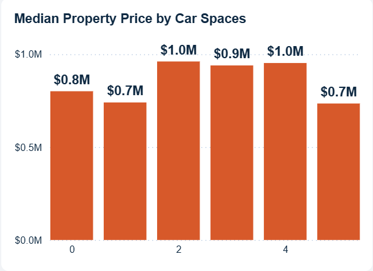

The relationship between car spaces and price is less linear. Properties with **0 car spaces** had a median price of around **$0.8M**, while properties with **2 and 4 car spaces** were close to **$1.0M**. Properties with **5 car spaces** had a lower median price of around **$0.7M**. This suggests that car spaces may influence price, but the relationship is weaker and less consistent than bedrooms, bathrooms, or property type. Location and property type may explain more of the price difference than parking alone.

## 4.6 Sales Volume and Median Price by Land Size Band

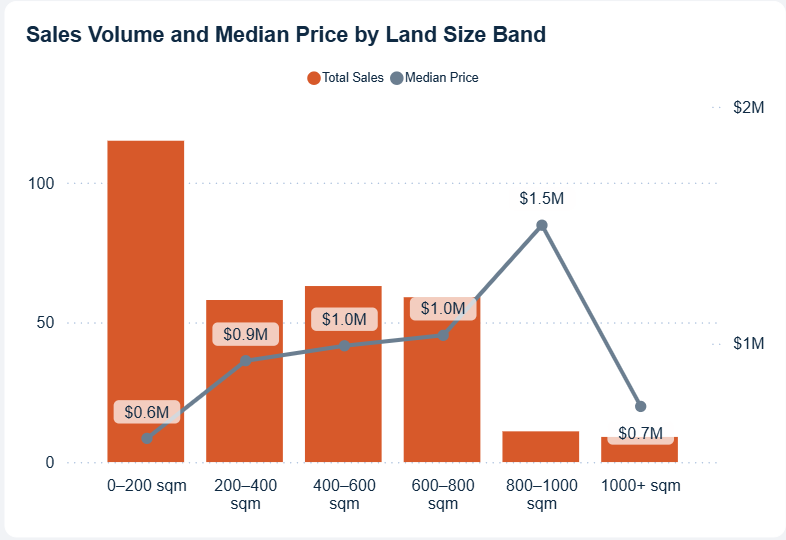

The land size analysis combines sales volume and median price. The **0–200 sqm** group had the highest sales volume, with more than **100 sales**, but the lowest median price at approximately **$0.6M**. This suggests that smaller properties were more frequently sold and generally more affordable.

Median price increased across larger land size bands. Properties in the **200–400 sqm** band had a median price of around **$0.9M**, while the **400–600 sqm** and **600–800 sqm** bands were close to **$1.0M**. The **800–1000 sqm** band reached the highest median price at approximately **$1.5M**. However, the **1000+ sqm** group dropped to around **$0.7M**, which may be due to lower transaction volume, location differences, or outlier effects.

Overall, the April 2016 sample shows that **property type, bedroom count, bathroom count, and land size** are important price drivers. However, not all features show a simple linear relationship with price, so feature-based analysis should be interpreted together with location and sales volume.

---

# 5. Page 4: Price Prediction & Market Recommendations

The final page adds a machine learning layer to the dashboard. The goal is to estimate property prices and compare predicted prices against actual sale prices to identify potential pricing opportunities or risks.

## What business question does this page answer?

- Can property and location features be used to predict sale price?
- How close are predicted prices to actual sale prices?
- Which properties appear potentially undervalued or overvalued?
- Which regions show the largest average prediction gaps?
- How can prediction outputs support market recommendation analysis?

## 5.1 Prediction KPI Summary

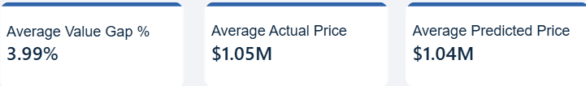

The model output shows an average actual price of approximately **$1.05M** and an average predicted price of approximately **$1.04M**. The average value gap is approximately **3.99%**, suggesting that the model’s predicted prices are slightly higher than actual prices on average. This indicates that the model output is broadly aligned with overall market pricing.

## 5.2 Actual vs Predicted Property Price

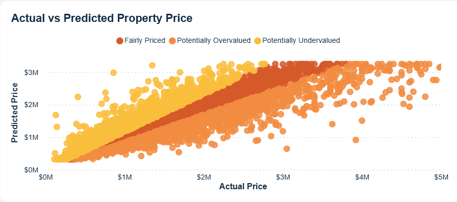

Each point represents one property sale. The x-axis shows the actual sale price, while the y-axis shows the machine learning predicted price. Points closer to the diagonal pattern indicate more accurate predictions. Properties where predicted price is higher than actual price may indicate potential undervaluation, while properties where predicted price is lower than actual price may indicate potential overvaluation.

## 5.3 Average Prediction Gap by Region

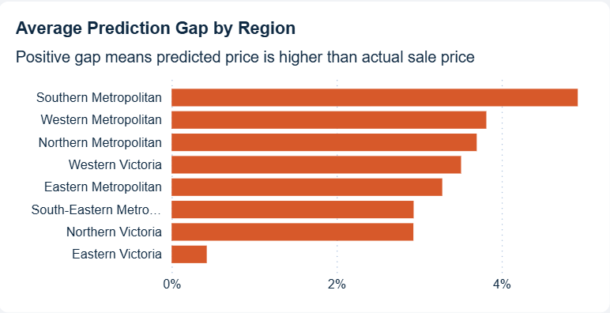

Southern Metropolitan has the highest average positive prediction gap at approximately **4.92%**, followed by Western Metropolitan and Northern Metropolitan. This suggests that, on average, predicted prices in these regions are slightly higher than actual sale prices. Eastern Victoria has the lowest average prediction gap, indicating that predicted and actual prices are more closely aligned in that region.

## 5.4 Top 5 Potentially Undervalued Properties

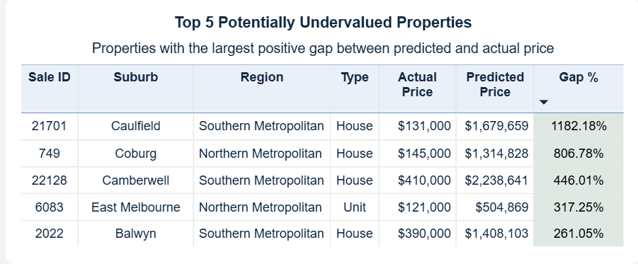

The Top 5 Potentially Undervalued Properties table highlights records with the largest positive gap between predicted price and actual sale price. These properties may represent potential pricing opportunities based on the model output. However, very large gaps should be interpreted carefully because they may reflect unusual sale conditions, data quality issues, or special property characteristics that are not fully captured in the dataset.

## 5.5 Prediction-Based Recommendation Distribution

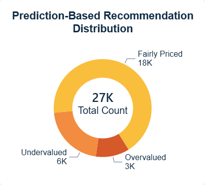

Most properties are classified as **Fairly Priced**, while smaller groups are classified as **Potentially Undervalued** or **Potentially Overvalued**. This makes the model output more practical because it does not treat every property as an opportunity. Instead, it separates properties into recommendation groups based on prediction gaps.

---

## 5.6 Machine Learning Methodology

A baseline linear regression model was first considered. However, linear regression can produce unrealistic predictions when extreme outliers are present because it assumes a linear relationship between features and price. For example, properties with unusually large land sizes can cause linear regression to extrapolate too strongly. During the testing process, when using linear regression, I spotted out the issue when a property value is over 1 million but the predicted price is over 9 million. This indicated that the model is not suitable. I also included the data for linear regression model in which I saved as Melbourne_Housing_prediction.csv and Melbourne_Housing_Model_Metrics.csv.

To improve prediction reliability, the model was upgraded to a **Random Forest Regressor**. Random Forest was selected because it can better capture non-linear relationships between property features and sale price.

The model used the following features:

- Rooms
- Bedrooms
- Bathrooms
- Car spaces
- Land size
- Building area
- Year built
- Distance from CBD
- Property count
- Property type
- Region

Extreme records were handled using a **model scope flag**. Properties outside the reasonable modelling range were marked as **Out of Model Scope** to reduce unreliable predictions and avoid using extreme outliers as recommendation outputs.

### Prediction Logic

```text
Value Gap % = (Predicted Price - Actual Price) / Actual Price
```

The recommendation categories were defined as:

```text
Gap ≥ 15%      → Potentially Undervalued
Gap ≤ -15%     → Potentially Overvalued
Within ±15%    → Fairly Priced
```

A positive value gap means the predicted price is higher than the actual sale price, which may indicate potential undervaluation. A negative value gap means the predicted price is lower than the actual sale price, which may indicate potential overvaluation.

---

# 6. Key Findings

- **Location is a major price driver.** Southern Metropolitan and Eastern Metropolitan have the highest median prices.
- **Distance from the CBD matters.** Median price generally decreases as distance from the CBD increases.
- **Houses dominate the market.** Houses account for the largest share of sales and have higher median prices than units and townhouses.
- **Property features influence price.** Bedrooms, bathrooms, property type, and land size show clear relationships with median price.
- **Median price is more reliable than average price for market comparison.** The dataset contains high-value outliers, so median price provides a more stable view of typical prices.
- **Machine learning supports recommendation analysis.** The model compares actual and predicted prices to classify properties as potentially undervalued, overvalued, or fairly priced.

---

# 7. Limitations

- The dataset covers historical transactions from **2016 to 2018**, so it does not reflect current market conditions.
- Several fields contain high missing-value rates, especially `BuildingArea` and `YearBuilt`.
- The dataset does not include external market factors such as interest rates, inflation, school zones, transport access, renovation quality, or economic conditions.
- Machine learning predictions are based only on available structured features and should not be used as professional property valuations.
- Very large prediction gaps may reflect unusual sale conditions, data quality issues, or outlier properties.
- Recommendation categories are model-based indicators and should be interpreted as exploratory insights rather than final investment advice.

---

# 8. Tools and Techniques Used

## Power BI

- Dashboard design
- Data modelling
- Star schema relationships
- DAX measures
- Dynamic ranking visuals
- Field parameters
- Slicers and navigation buttons
- Custom tooltip pages

## Power Query

- Data cleaning
- Data type conversion
- Duplicate removal
- Feature transformation
- Dimension table creation

## Python

- Data preprocessing
- Machine learning model development
- Prediction output generation
- Model evaluation

## Python Libraries

- Pandas
- NumPy
- Scikit-learn

## Machine Learning

- Random Forest Regression
- Train-test split
- Mean Absolute Error
- Root Mean Squared Error
- R² score
- Value gap calculation
- Recommendation category classification

---

# 9. Project Summary

This project demonstrates how Power BI and Python can be combined to create an end-to-end data analytics solution.

The Power BI dashboard provides interactive market analysis across sales trends, regional performance, suburb rankings, property features, and price drivers. The Python machine learning model adds a predictive layer by estimating property prices and classifying properties based on value gap analysis.

Overall, the project shows the ability to clean and model data, build interactive dashboards, apply machine learning, and translate technical outputs into business-focused insights.
